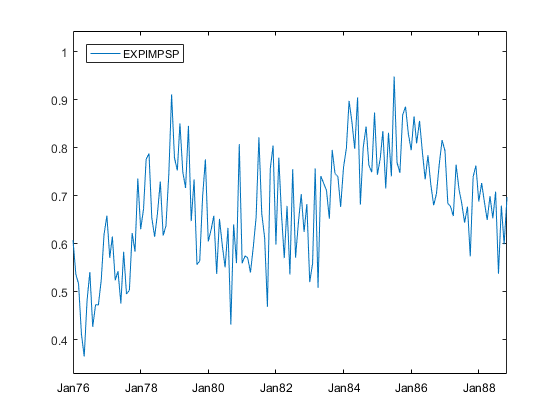
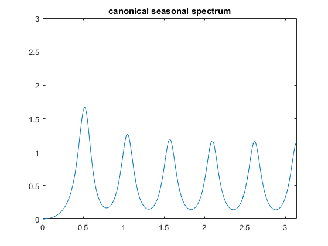
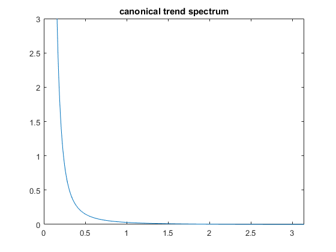
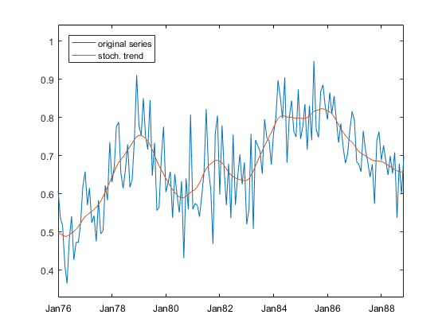

[](http://quantlet.de/)

## [](http://quantlet.de/) **SSM_TRAMO_SEATSex2_d** [](http://quantlet.de/)

```yaml

Name of QuantLet: SSM_TRAMO_SEATSex2_d

Published in: Linear Time Series With MATLAB and Octave

Description: 'A Spanish series of trade balance is used to illustrate the canonical decomposition.'

Keywords: time-series, ARIMA model, canonical decomposition, unobserved components, automatic model identification

Author: Víctor Gómez

Submitted: Wed, January 23 2019 by Víctor Gómez

```









### MATLAB Code
```matlab

%
%Example of a series treated with TRAMO/SEATS. Series is example EXPIMPSP
%from TSW+. It is the Spanish series of trade balance (measured as
%the ratio of exports to imports) for the period 1976-1 to 1988-11. This
%series was one of the series of example 19 in the TRAMO/SEATS software.
%

clear
%
% Model identified by TSW+ is (2,0,1)(1,0,0)_12 with mean. Model identified
% by SSMMATLAB is (0,1,1)(1,0,0)_12 without mean. We can estimate both
% models. The results are very similar to those obtained with TSW+. One
% outlier, 70 AO, is identified with both programs.
%
sname = 'EXPIMPSP';
out = arimaestos(sname);

%
%SEATS residuals
%
[sres] = SEATSres(out);
%
%ols recursive residuals
%
[olsrress, olsrres] = OLSrres(out);
%
%OLS residuals
%
[olsres] = OLSres(out);
%
%smoothed residuals
%
[smtres] = SMTres(out);

s = out.freq;
if out.model.d > 0
    d = out.model.d;
else
    d = 0;
end
if out.model.ds > 0
    ds = out.model.ds;
else
    ds = 0;
end
%
%plot smoothed and ols residuals.There are n smt residuals and n-ndelta ols
%residuals, where n is the length of the series y and ndelta is the degree
%of differencing.
%
[ns, ms] = size(smtres);
ndelta = d + ds * s;
vnames = char('olsres', 'smtres');
bg_year = out.nziyip(2);
bg_per = out.nziyip(3);
res = cal(bg_year, bg_per, s, ndelta+1);
ndatei = cal(res.year, res.period, s);
figure
tsplot([olsres, smtres(ndelta+1:ns)], ndatei, vnames);
pause
%
%plot standardized ols recursive residuals.There are n-ndelta-nbeta of
%those residuals, where n is the length of the series, ndelta is the degree
%of differencing and nbeta is the number of regressors. These residuals are
%uncorrelated and preserve the temporal dimension.
%
nbeta = length(out.model.hb);
ndelta = d + ds * s;
vnames = 'standardized ols recursive residuals';
bg_year = out.nziyip(2);
bg_per = out.nziyip(3);
res = cal(bg_year, bg_per, s, ndelta+nbeta+1);
ndatei = cal(res.year, res.period, s);
figure
tsplot(olsrress, ndatei, vnames);
pause


%
%Signal extraction using the canonical decomposition
%
Ycomp{1} = 'irreg'; %assign the outlier to the irregular
outa = arimasigex(out, Ycomp);

%plot spectra
if out.gft == 1
    plotspcd(outa)
end

thrc = outa.compcd.ptnum; % trend-cycle numerator
phir = outa.compcd.ptden; % trend-cycle denominator
%   outa.compcd.ptnur;    % number of nonstationary roots in phir
sigma2r = outa.compcd.ptvar; % variance of the trend-cycle innovations (*)
thsc = outa.compcd.stnum; % seasonal numerator
phis = outa.compcd.stden; % seasonal denominator
%   outa.compcd.stnur; % number of nonstationary roots in phis
sigma2s = outa.compcd.stvar; % variance of the seasonal innovations (*)
thtc = outa.compcd.rt; % transitory component (MA term)
sigma2t = outa.compcd.rtvar; % variance of the transitory component innovations (*)
sigma2i = outa.compcd.itvar; % variance of the irregular component (*)
phitc = outa.compcd.phi; % stationary AR trend polynomial
%(*) in units of the series model innovations

disp('trend-cycle numerator:')
disp(thrc)
disp('trend-cycle denominator:')
disp(phir)
disp('variance of the trend-cycle innovations (*)')
disp(sigma2r)
pause
disp('seasonal numerator:')
disp(thsc)
disp('seasonal denominator:')
disp(phis)
disp('variance of the seasonal innovations (*)')
disp(sigma2s)
pause
disp('stationary AR trend polynomial')
disp(phitc)
pause
disp('variance of the irregular component (*)')
disp(sigma2i)
if ~isempty(thtc)
    disp('transitory numerator:')
    disp(thtc)
    phit = 1.;
    disp('transitory denominator:')
    disp(phit)
    disp('variance of the transitory innovations (*)')
    disp(sigma2t)
end
disp('(*) in units of var(A)')

```

automatically created on 2019-02-11