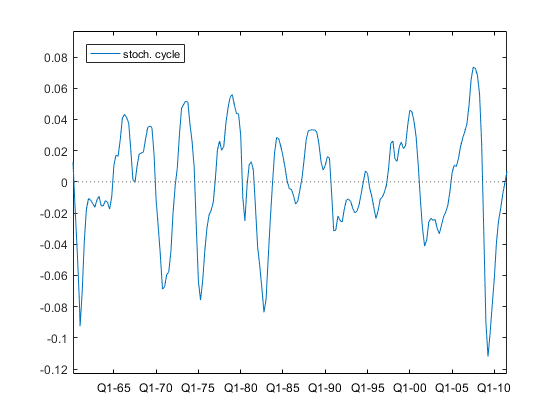
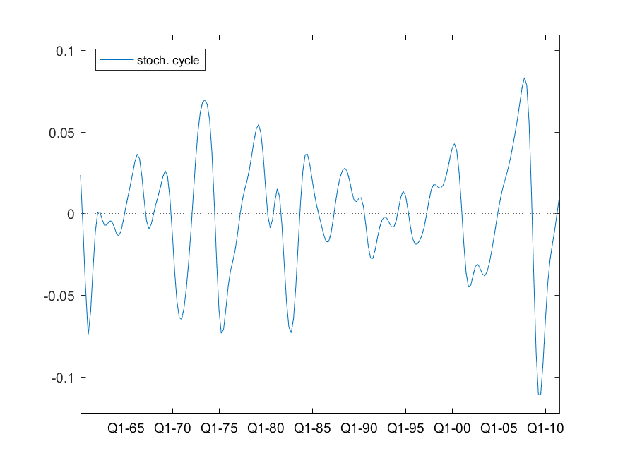
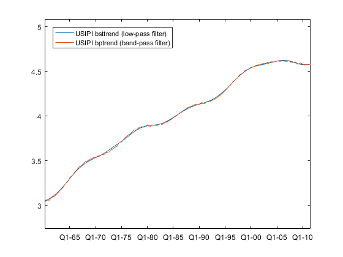

[](http://quantlet.de/)

## [](http://quantlet.de/) **SSM_USIPIcdstcl_d** [](http://quantlet.de/)

```yaml

Name of QuantLet: SSM_USIPIcdstcl_d

Published in: Linear Time Series With MATLAB and Octave

Description: 'A smooth trend is estimated for the quarterly IPI series of USA.'

Keywords: time-series, ARIMA model, canonical decomposition, fixed filters, smooth trend

Author: Víctor Gómez

Submitted: Thu, January 24 2019 by Víctor Gómez

```








### MATLAB Code
```matlab

%
% US Industrial Production Index, 1960-I, 2011-III
%
% 1) An ARIMA model is estimated first (specification file USIPI.m in
%    subdirectory spec).
% 2) The canonical decomposition is obtained
% 3) A low-pass filter (HP filter) is applied to the canonical trend. A
%    smooth trend an a cycle are obtained whose sum is the canonical trend.
% 4) A band-pass filter is applied to the canonical trend. A smooth cycle
%    and a trend are obtained whose sum is the canonical trend.
%
% Steps 3) and 4) are based on Gómez, V. (2001). ''The use of butterworth
% filters for trend and cycle estimation in economic time series''.
% Journal of Business and Economic Statistics, 19, 365–373. The algorithms
% for many of the procedures are described in Gómez (2016), ''Multivariate
% Time Series With Linear State Space Structure''. Springer International
% Publishing AG: Switzerland
%

clear;

%arima estimation
out = arimaestos('USIPI');

%
%Signal extraction using the canonical decomposition
%
Ycomp{1} = 'trend'; %assign the outlier to the trend
outa = arimasigex(out, Ycomp);

%plot spectra
if out.gft == 1
    plotspcd(outa)
end

thrc = outa.compcd.ptnum; % trend-cycle numerator
phir = outa.compcd.ptden; % trend-cycle denominator
%   outa.compcd.ptnur;    % number of nonstationary roots in phir
sigma2r = outa.compcd.ptvar; % variance of the trend-cycle innovations (*)
thsc = outa.compcd.stnum; % seasonal numerator
phis = outa.compcd.stden; % seasonal denominator
%   outa.compcd.stnur; % number of nonstationary roots in phis
sigma2s = outa.compcd.stvar; % variance of the seasonal innovations (*)
thtc = outa.compcd.rt; % transitory component (MA term)
sigma2t = outa.compcd.rtvar; % variance of the transitory component innovations (*)
sigma2i = outa.compcd.itvar; % variance of the irregular component (*)
phitc = outa.compcd.phi; % stationary AR trend polynomial
%(*) in units of the series model innovations

disp('trend-cycle numerator:')
disp(thrc)
disp('trend-cycle denominator:')
disp(phir)
disp('variance of the trend-cycle innovations (*)')
disp(sigma2r)
pause
disp('seasonal numerator:')
disp(thsc)
disp('seasonal denominator:')
disp(phis)
disp('variance of the seasonal innovations (*)')
disp(sigma2s)
pause
disp('stationary AR trend polynomial')
disp(phitc)
pause
disp('variance of the irregular component (*)')
disp(sigma2i)
if ~isempty(thtc)
    disp('transitory numerator:')
    disp(thtc)
    phit = 1.;
    disp('transitory denominator:')
    disp(phit)
    disp('variance of the transitory innovations (*)')
    disp(sigma2t)
end


%
% Model estimated by SSMMATLAB
% phi=[-0.4955 1]; Th=[-0.8602 1]; stand. dev. of resid.: 0.0168
%
% The canonical decomposition of this model gives rise to the following
%
%                   Models for the components
%
% thrc =  [0.152026889866882 -0.96887853586144 -0.120905521525256 1]
% phir =  [-0.495522141473805 1.99104428294761 -2.49552214147381 1]
% sigma2r = 0.315426154707379
% thsc =  [0.0178669154270012 1.02589453460847 1.46716823010592 1]
% phis =  [1 1 1 1]
% sigma2s = 0.00186776381036522
% sigma2i = 0.0967398166763092
% stand. dev. of resid (sconp) = 0.0168347718573963


% Models for the components obtained by SEATS (Canonical decomposition),
% assuming that the model has been estimated by TRAMO
% Model estimated by TRAMO
% phi=[-.49555 1]; Th=[-.86020 1]; stand. dev. of resid.: 0.1661D-01
%
%                   MODELS FOR THE COMPONENTS
%
%  TREND-CYCLE NUMERATOR
%    1.00000000000000      -0.120915955672721      -0.968885573465440
%   0.152030382207280
%  TREND-CYCLE DENOMINATOR
%      1.0000    -2.4956     1.9911    -0.4956
%  INNOV. VAR. (*)     0.31544
%
%  SEAS. NUMERATOR
%    1.00000000000000        1.46717885612683        1.02591246661574
%   1.787979416833018E-002
%  SEAS. DENOMINATOR
%      1.0000     1.0000     1.0000     1.0000
%  INNOV. VAR. (*)     0.00187
%
%  IRREGULAR
%  VAR.     0.09674
%
% (*)   IN UNITS OF VAR(A)
% STANDARD DEVI. OF RESID=  0.1661D-01
%

% ***********************************************************************
%                        LOW-PASS FILTERS
%
% design of a low-pass filter to obtain a smooth trend and a cycle. The
% filter is specified giving Lambda and Di. The sine But. filter is the
% Hodrick-Prescott filter. The filter will be applied to the canonical
% trend.
Lambda = 1600;
Di = 2;
% select from the two following lines the tangent or the sine But. filter
% by uncommenting or commenting the appropriate lines.
% [compf,ferror]=dtanbut([],[],[],Di,[],Lambda);
[compbst, ~] = dsinbut([], [], [], Di, [], Lambda);
% plot gain function of both low-pass filters
figure
ggsintanbut([], [], [], compbst.Di, compbst.Thetac)
pause
close all

%estimation of smooth trend and cycle by applying a low-pass filter to the
%trend-cycle component of the canonical decomposition.
filter = 'lp';
outb = arimasigextc(outa, compbst, filter);

%************************************************************************
%                    BAND-PASS FILTER
%
% design of band-pass filter to obtain a well defined cycle and a
% relatively smooth trend. Frequencies are expressed divided by pi. The
% filter will be applied to the canonical trend.
D(1) = .1;
D(2) = .1;
xp1 = .0625;
xp2 = .3;
xs = .4;
% Tangent band-pass filter
[compbp, ferror] = dbptanbut(D, xp1, xp2, xs);
% plot gain function of the tangent band-pass filter
figure
ggbptanbut(D, xp1, xp2, xs, compbp.Di, compbp.Alph, compbp.Lambda)
pause
close all

%estimation of smooth cycle and trend by applying a band-pass filter to the
%trend-cycle component of the canonical decomposition.
filter = 'bp';
outc = arimasigextc(outa, compbp, filter);

%additional plots
datei = outa.datei;
% plot both the smooth and the canonical trend
trend = outa.StochCc(:, 1);
bsttrend = outb.StochCctc(:, 1);
vnames = char('USIPI trend', 'USIPI bsttrend (low-pass filter)');
figure
tsplot([trend, bsttrend], datei, vnames);
pause

%plot both the band-pass filter and the canonical trend
bptrend = outc.StochCctc(:, 1);
vnames = char('USIPI trend', 'USIPI bptrend (band-pass filter)');
figure
tsplot([trend, bptrend], datei, vnames);
pause

%plot both the smooth and the band-pass filter trend
vnames = char('USIPI bsttrend (low-pass filter)', 'USIPI bptrend (band-pass filter)');
figure
tsplot([bsttrend, bptrend], datei, vnames);
pause

% plot both the band-pass filter and the low-pass filter cycle
bstcycle = outb.StochCctc(:, 2);
bpcycle = outc.StochCctc(:, 2);
figure
vnames = char('USIPI btcycle', 'USIPI bpcycle');
tsplot([bstcycle, bpcycle], datei, vnames);
pause
close all

```

automatically created on 2019-02-11