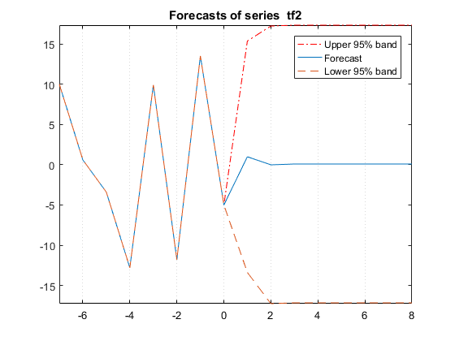

[](http://quantlet.de/)

## [](http://quantlet.de/) **SSM_tf2_d** [](http://quantlet.de/)

```yaml

Name of QuantLet: SSM_tf2_d

Published in: Linear Time Series With MATLAB and Octave

Description: 'A transfer function model is estimated. The series is tf2, documented in the software package SCA.'

Keywords: time-series, transfer function model, exact maximum likelihood method, Kronecker indices, VARMAX model

Author: Víctor Gómez

Submitted: Tue, January 15 2019 by Víctor Gómez

```



### MATLAB Code
```matlab

%Example of estimation of a transfer function model by exact maximum
%likelihood. The series is tf2, documented in SCA "Time Series for Research
%and Teaching".
%model is:
% (1-B)y_t = (3-2*B)(1-B)x_{t-1} + (1-.7*B)a_t
%
%input model is
% (1-B)x_t = alpha_t
%

%load data
yy = load(fullfile('data', 'vf_tf2.dat'));
y = yy(:, 1);
x = yy(:, 2);
seas = 1;
[ny, s] = size(y);
[nx, mx] = size(x);

%difference series
yd = diferm(y, 1);
xd = diferm(x, 1);

disp(' ')
disp('estimate Kronecker indices for the differenced series')
disp('press any key to continue')
pause
%estimate the Kronecker indices for the original series
prt = 0;
maxorder = 5;
hr3 = 0;
[order, kro, scm] = varmaxscmidn(yd, xd, seas, maxorder, hr3, prt);
disp('estimated Kronecker Indices for the original series ')
disp('using function "varmaxscmidn":')
disp(kro)
disp('press any key to continue')
pause


disp(' ')
disp('estimate a simplified VARMAX(2,2,2) using the HR method')
disp('press any key to continue')
pause


%estimate model using HR method (K.i. = 2)
hr3 = 0;
finv2 = 1;
mstainv = 1;
nsig = [1, 1];
tsig = [1., 1.];
strv = estvarmaxkro(yd, xd, seas, kro, hr3, finv2, mstainv, nsig, tsig);
maxkro = max(kro) + 1;
disp(' ');
disp('***** Estimated VARMAX Model  *****');
disp(' ');
clear in
in.fid = 1;
in.fmt = char('%12.4f');
tit = 'phi';
strt = 0;
mprintar(strv.phis3(:, :, 1:maxkro), in, tit, strt);
disp(' ')
tit = 'gamma';
strt = 0;
mprintar(strv.gammas3(:, :, 1:maxkro), in, tit, strt);
disp(' ')
tit = 'th';
strt = 0;
mprintar(strv.thetas3(:, :, 1:maxkro), in, tit, strt);
disp(' ')
tit = 'Constant';
mprintar(strv.mus3', in, tit);
disp(' ')
tit = 'tv-phi';
strt = 0;
mprintar(strv.phitv3(:, :, 1:maxkro), in, tit, strt);
disp(' ')
tit = 'tv-gamma';
strt = 0;
mprintar(strv.gammatv3(:, :, 1:maxkro), in, tit, strt);
disp(' ')
tit = 'tv-th';
strt = 0;
mprintar(strv.thetatv3(:, :, 1:maxkro), in, tit, strt);
disp(' ')
tit = 'tv-Constant';
mprintar(strv.mutv3', in, tit);
disp(' ')
tit = 'Sigma';
mprintar(strv.sigmar3, in, tit);


disp(' ')
disp('estimate using the conditional method')
disp('press any key to continue')
pause


%estimate using the conditional method
[xvfc, strc, ferrorc] = mconestim(yd, xd, strv);

disp(' ');
disp('***** Estimated Model using the conditional method  *****');
disp(' ');
clear in
in.fid = 1;
in.fmt = char('%12.4f');
tit = 'phi';
strt = 1;
mprintar(strc.phiscon(:, :, 2:3), in, tit, strt);
disp(' ')
tit = 'th';
strt = 1;
mprintar(strc.thetascon(:, :, 2:3), in, tit, strt);
disp(' ')
tit = 'gamma';
strt = 0;
mprintar(strc.gammascon(:, :, 1:3), in, tit, strt);
disp(' ')
tit = 'Mean';
mprintar(strc.muscon', in, tit);
disp(' ')
tit = 'Sigma';
mprintar(strc.sigmarcon, in, tit);
disp(' ')
disp(' ')
disp('t-values: ')
tit = 'tv-phi';
strt = 1;
mprintar(strc.phitvcon(:, :, 2:3), in, tit, strt);
disp(' ')
tit = 'tv-th';
strt = 1;
mprintar(strc.thetatvcon(:, :, 2:3), in, tit, strt);
disp(' ')
tit = 'tv-gamma';
strt = 0;
mprintar(strc.gammatvcon(:, :, 1:3), in, tit, strt);
disp(' ');
tit = 'tv-Mean';
mprintar(strc.mutvcon', in, tit);
disp(' ')
disp('press any key to continue')
pause


disp(' ')
disp('estimate using the exact method')
disp('press any key to continue')
pause

%estimate model using the exact method
Y = 1.;
[xvfx, strx, ferror] = mexactestimc(yd, xd, strc, Y);
conp = strx.sigma2c;

disp(' ');
disp('***** Estimated Model using the exact method  *****');
disp(' ');
clear in
in.fid = 1;
in.fmt = char('%12.4f');
tit = 'phi';
strt = 1;
mprintar(strx.phisexct(:, :, 2:3), in, tit, strt);
disp(' ')
tit = 'th';
strt = 1;
mprintar(strx.thetasexct(:, :, 2:3), in, tit, strt);
disp(' ')
tit = 'gamma';
strt = 0;
mprintar(strx.gammasexct(:, :, 1:3), in, tit, strt);
disp(' ')
tit = 'Mean';
mprintar(strx.musexct', in, tit);
disp(' ')
tit = 'Sigma';
mprintar(strx.sigmarexct, in, tit);
disp(' ')
disp(' ')
disp('t-values: ')
tit = 'tv-phi';
strt = 1;
mprintar(strx.phitvexct(:, :, 2:3), in, tit, strt);
disp(' ')
tit = 'tv-th';
strt = 1;
mprintar(strx.thetatvexct(:, :, 2:3), in, tit, strt);
disp(' ')
tit = 'tv-gamma';
strt = 0;
mprintar(strx.gammatvexct(:, :, 1:3), in, tit, strt);
disp(' ');
tit = 'tv-Mean';
mprintar(strx.mutvexct', in, tit);
disp('press any key to continue')
pause


%compute forecasts of the differenced series
npr = 8;
freq = 1;
if (npr > 0)
    chb = 1;
    Y = 1.;
    [ff, beta, e, f, strx, stx, recrs] = exactmedfvc(xvfx, yd, xd, strx, Y, chb);
    %endogenous part
    A = stx.A;
    P = stx.P;
    Z = stx.Z;
    G = stx.G;
    T = stx.T;
    H = stx.H;
    hb = stx.hb;
    Mb = stx.Mb;
    Xp = Y;
    Wp = [];
    cw = 1.96;
    s = 1; %number of series
    [pry, mypr, alpr, malpr] = ssmpred(npr, s, A, P, Xp, Z, G, Wp, T, H, hb, Mb);
    spry = zeros(s, npr);
    %exogenous part
    %inputs are stochastic
    hr3 = 1;
    finv2 = 0;
    [strv, ferror] = estvarmaxpqrPQR(xd, [], freq, [0, 0, 0], [0, 0, 0], hr3, finv2);
    sts.T = 0;
    sts.Z = 0;
    H = 0;
    Sg = strv.sigmar2;
    [R, p] = chol(Sg);
    L = R';
    sts.H = H;
    sts.G = L;
    [prx, mxpr, glpr, mglpr] = ssmpredexg(npr, xd, stx, sts);
    %forecasts and their mse
    pry = pry + prx;
    mypr = mypr * conp + mxpr;
    for i = 1:npr
        spry(:, i) = sqrt(diag(mypr(:, :, i)));
    end
    opry = pry;
    ospry = spry;
    %plot forecasts
    tname = 'tf2';
    out.pry = pry(1, :);
    out.spry = spry(1, :);
    out.opry = opry(1, :);
    out.ospry = ospry(1, :);
    out.y = yd(:, 1);
    out.yor = yd(:, 1);
    out.ny = length(yd(:, 1));
    out.npr = npr;
    out.cw = cw;
    out.tname = tname;
    lam = 1; %lam=0, logs are taken; =1, no logs are taken
    out.lam = lam;
    out.s = freq;
    pfctsusm(out);
end

```

automatically created on 2019-02-11