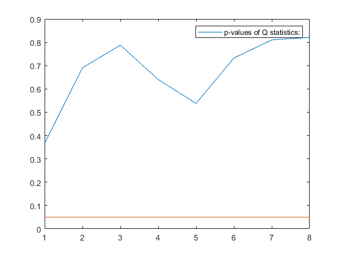

[](http://quantlet.de/)

## [](http://quantlet.de/) **SSM_varmapqPQ2_d** [](http://quantlet.de/)

```yaml

Name of QuantLet: SSM_varmapqPQ2_d

Published in: Linear Time Series With MATLAB and Octave

Description: 'The OLS residuals are computed for a simulated VARMA(1,1) model in state space form.'

Keywords: time-series, OLS residuals, state space model, VARMA model, exact maximum likelihood method
Author: Víctor Gómez

Submitted: Thu, January 31 2019 by Víctor Gómez

```



### MATLAB Code
```matlab

%Example of estimation of a VARMA(p,q)(P,Q)_s model in which we fix some
%parameters. The initial estimates are obtained using the Hannan-Rissanen
%method. For the estimation, the conditional method and the exact methods
%are used.
%Series is simulated series from Tiao and Box (1981)
% -- THIS IS A SIMULATED VECTOR ARMA(1,1) EXAMPLE
% --INPUT VARI ARE CONST, PHI, THETA, MEAN, SIGMA. NCOLS 1,2,2,1,2.
% -- 1.20  0.7 0.0  0.5 0.4  0.0  1.0 1.2
% -- 2.20  0.4 0.9  0.0 0.5  0.0  1.2 4.0
% --END OF DATA
% --MTSMODEL NAME IS ARMA11. SERIES ARE S1,S2. MODEL IS  @
% --  (1 - PHI*B)SERIES=CONST + (1 - THETA*B)NOISE.
%

clear
y = load(fullfile('data', 'vf_classarma.dat'));
x = [];

% define model.
freq = 1;
npr = 12; %number of forecasts
%copy npr in mpr and make npr zero for estimation
if npr > 0
    mpr = npr;
    npr = 0;
else
    mpr = 0;
end

lag = 20;
cw = 1.96;
ds = 0;
dr = 0;
tname = {'TB simulated ARMA(1,1) 1', 'TB simulated ARMA(1,1) 2'};
for i = 1:2
    c0 = sacspacdif(y(:, i), tname(i), dr, ds, freq, lag, cw);
    pause
end
close all

%estimate model using HR method
seas = 1;
[strv, ferror] = estvarmaxpqrPQR(y, x, seas, [1, 1, 0], [0, 0, 0], 0, 1, 1);

%estimate using the conditional method
[xvfc, strv, ferrorc] = mconestim(y, x, strv);

%setup model
Phi = eye(2);
Th = eye(2);
phi = strv.phiscon;
th = strv.thetascon;
Sigma = strv.sigmarcon;

%create structure and put model into state space form
[str, ferror] = suvarmapqPQ(phi, th, Phi, Th, Sigma, freq);
%create regression variable for the mean
Y = eye(2);

%estimate model using the exact method
result = varmapqPQestim(y, str, Y);

disp(' ');
disp('******************** Results from exact estimation ********************');
disp(' ');
mprintr(result)
disp('press any key to continue')
pause

%fix two insignificant parameters to zero and set up model again
phi(1, 2, 2) = 0.;
th(2, 1, 2) = 0.;
[str, ferror] = suvarmapqPQ(phi, th, Phi, Th, Sigma, freq);
str.phin(1, 2, 2) = 0;
str.thn(2, 1, 2) = 0;
[str, ferror] = fixvarmapqPQ(str);
%reestimate model
result = varmapqPQestim(y, str, Y);

disp(' ');
disp('***** Results from exact estimation after fixing some parameters  *****');
disp(' ');
mprintr(result)
disp('press any key to continue')
pause

%estimated and fixed parameters
xvf = result.xvf;
xf = result.xf;
%t-values of varma estimated parameters are in result.tv
%t-values of estimated regression parameters are in result. tvr

%create estimated model
[phif, thf, Phif, Thf, Lf, ferror] = pr2varmapqPQ(xvf, xf, str);

disp(' ');
disp('***** Estimated Model  *****');
disp(' ');
clear in
in.fid = 1;
in.cnames = char(' phi(1):', ' ', ' th(1):', ' ', ' Sigma:', ' ');
in.fmt = char('%12.4f');
z = [phif(:, :, 2), thf(:, :, 2), result.Sigmar];
mprint(z, in);
disp(' ')
clear in
in.cnames = char(' Mean:');
in.fmt = char('%12.4f');
mprint(result.h, in);
disp('press any key to continue')
pause

%compute OLS residuals
[strf, ferror] = suvarmapqPQ(phif, thf, Phif, Thf, result.Sigmar, freq);
%set up regression matrices
X = Y;
W = [];
%set up system matrices
T = strf.T;
Z = strf.Z;
G = strf.G;
H = strf.H;
%set up initial conditions
ndelta = 0; %number of unit roots
[ins, i, ferror] = incossm(T, H, ndelta);
[KKP, Pt, recrs, recr] = scakfff(y, X, Z, G, W, T, H, ins, i, result.h);
%plot OLS residuals
plot(recr(:, 1)), legend('recr(:,1)'), pause
plot(recr(:, 2)), legend('recr(:,2)'), pause
close all
%compute autocovariance and autocorrelation matrices of OLS residuals
lag = 8;
ic = 1;
nr = 0;
disp(' ')
disp('******** OLS Residuals:     ********');
stre = mautcov(recr, lag, ic, nr);
disp('Correlation matrix at lag 0:')
disp(stre.r0)
disp('Q statistics:')
disp(stre.qstat)

disp('p-values of Q statistics:')
disp(stre.pval)
[m, n] = size(stre.pval);
t = 1:m;
plot(t, stre.pval, t, 0.05*ones(1, m))
legend('p-values of Q statistics:')
disp('press any key to continue')
pause
close all


%compute forecasts
if mpr > 0
    %hb, Mb, A and P are in structure result. Here, hb is the vector of
    %regression estimates and Mb is the matrix of standard errors. A is the
    %estimated state vector, x_{t|t-1}, obtained with the Kalman filter at the
    %end of the sample and P is the matrix of standard errors.
    hb = result.h;
    Mb = result.H;
    A = result.A;
    P = result.P;
    
    npr = mpr;
    Xp = Y;
    Wp = [];
    cw = 1.96;
    m = 2; %number of series
    [pry, mypr, alpr, malpr] = ssmpred(npr, m, A, P, Xp, Z, G, Wp, T, H, hb, Mb);
    conp = result.sigma2c;
    spry = zeros(m, npr);
    sconp = sqrt(result.sigma2c);
    for i = 1:npr
        spry(:, i) = sqrt(diag(mypr(:, :, i))) * sconp;
    end
    opry = pry;
    ospry = spry;
    %plot forecasts
    tname = 'var1';
    out.pry = pry(1, :);
    out.spry = spry(1, :);
    out.opry = opry(1, :);
    out.ospry = ospry(1, :);
    out.y = y(:, 1);
    out.yor = y(:, 1);
    out.ny = length(y(:, 1));
    out.npr = npr;
    out.cw = cw;
    out.tname = tname;
    lam = 1; %lam=0, logs are taken; =1, no logs are taken
    out.lam = lam;
    out.s = freq;
    pfctsusm(out);
    tname = 'var2';
    out.pry = pry(2, :);
    out.spry = spry(2, :);
    out.opry = opry(2, :);
    out.ospry = ospry(2, :);
    out.y = y(:, 2);
    out.yor = y(:, 2);
    out.ny = length(y(:, 2));
    out.npr = npr;
    out.cw = cw;
    out.tname = tname;
    lam = 1; %lam=0, logs are taken; =1, no logs are taken
    out.lam = lam;
    out.s = freq;
    pfctsusm(out);
end

```

automatically created on 2019-02-11